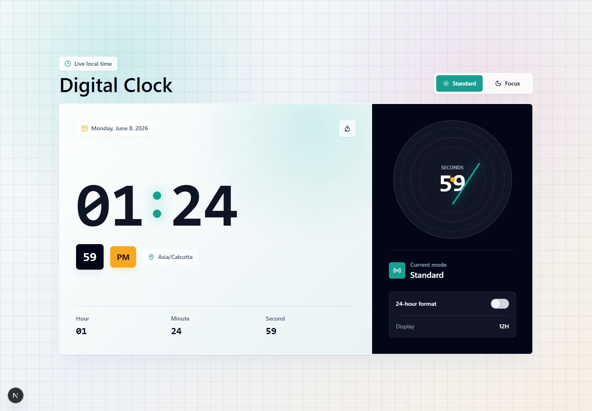
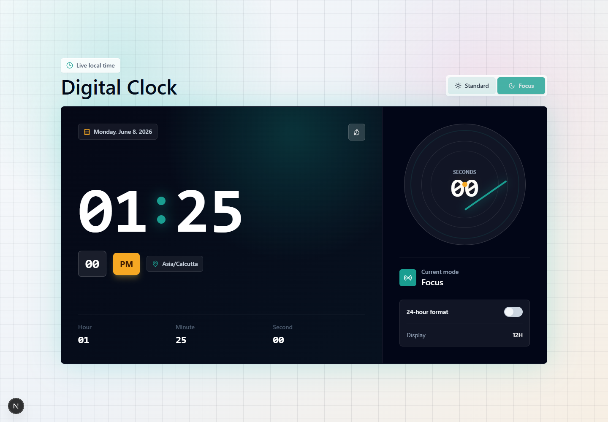
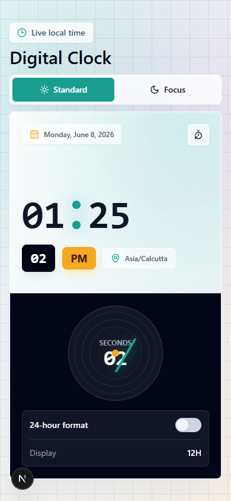
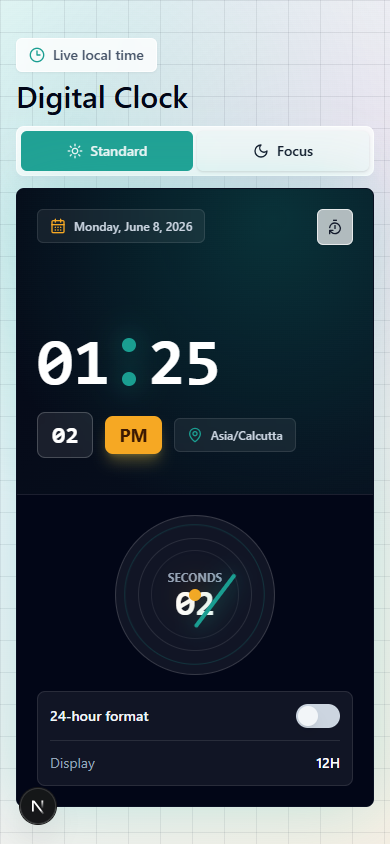
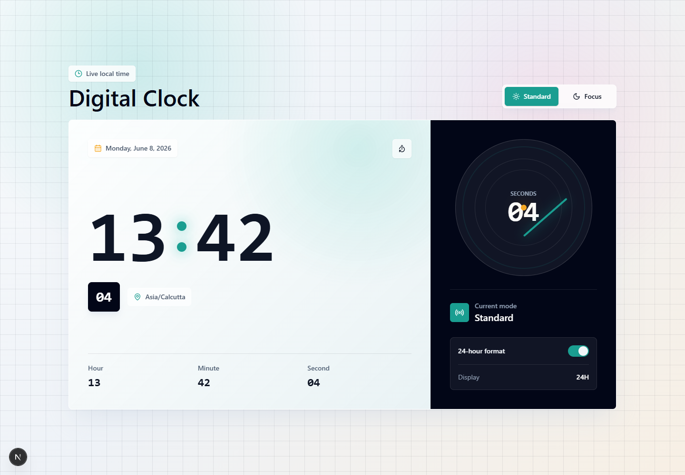

# Simple Digital Clock

## Screenshots

### Desktop View

| Standard Theme | Focus Theme |
| --- | --- |
|  |  |

### Mobile View

| Standard Theme | Focus Theme |
| --- | --- |
|  |  |

### 24-Hour Format



## About This Repo

A polished digital clock built with **Next.js**, **Tailwind CSS**, and local **shadcn/ui-style components**. The app shows live local time with a clean desktop dashboard layout and a compact mobile view that fits inside one viewport.

This repository is a small UI-focused project created as a digital clock exercise. The emphasis is on visual polish, responsive layout behavior, and clean component structure rather than complex business logic.

## Features

- Live local digital clock with hours, minutes, and seconds
- Standard and Focus visual themes
- 12-hour and 24-hour format toggle
- Local date and timezone display
- Responsive desktop and mobile layouts
- Mobile view optimized to fit within `100vh`

## Tech Stack

- Next.js App Router
- React
- TypeScript
- Tailwind CSS
- shadcn/ui-style components
- Lucide React icons

## Getting Started

Install dependencies:

```bash
npm install
```

Run the development server:

```bash
npm run dev
```

Open the app:

```text
http://localhost:3000
```

Build for production:

```bash
npm run build
```

## Project Structure

```text
app/
  globals.css
  layout.tsx
  page.tsx
components/
  digital-clock.tsx
  ui/
lib/
  utils.ts
artifacts/
  clock-desktop-styled.png
  clock-desktop-focus.png
  clock-mobile-styled.png
  clock-mobile-focus.png
  clock-desktop-24h.png
```
