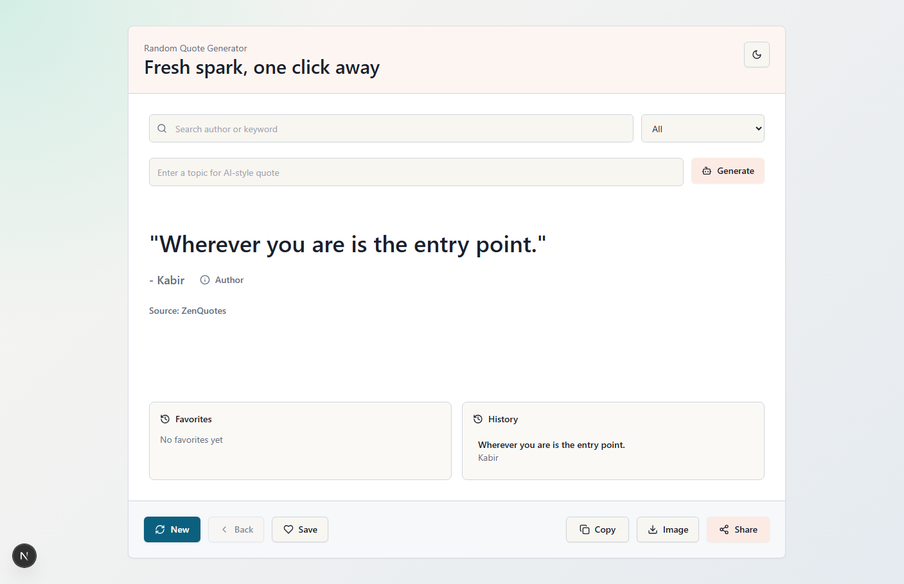
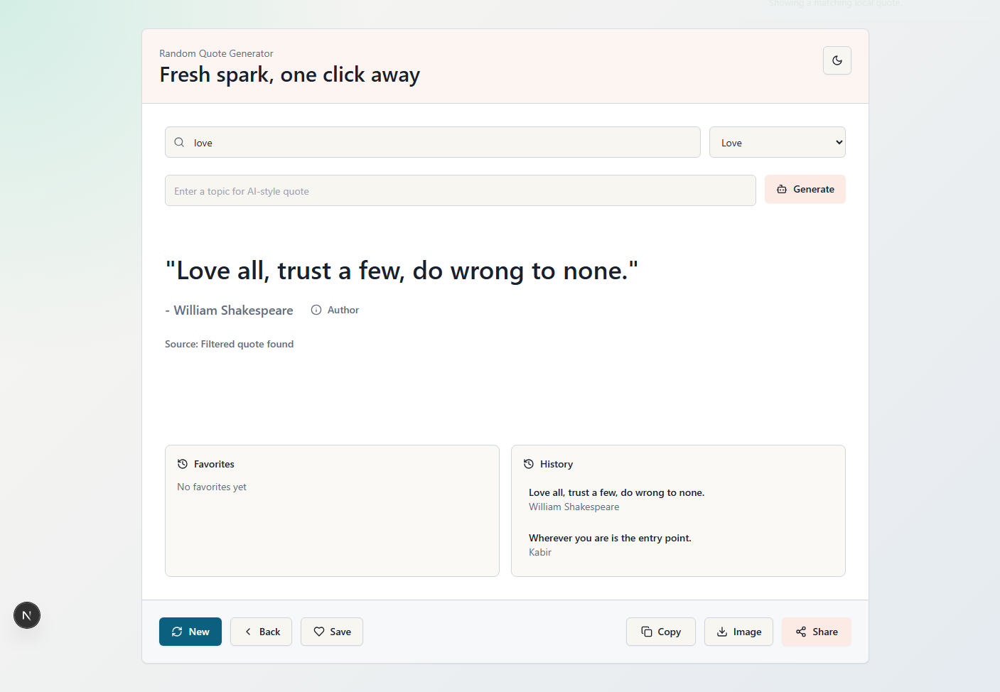
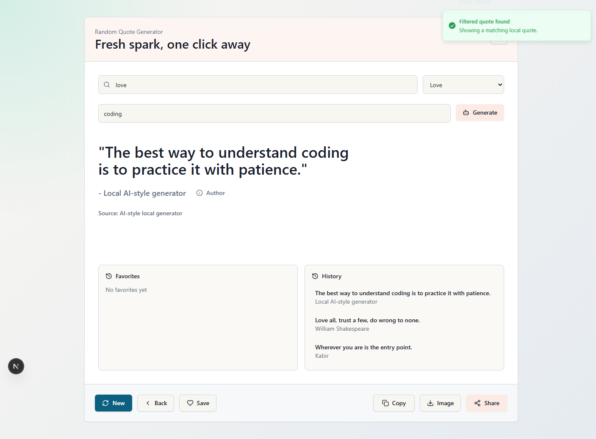
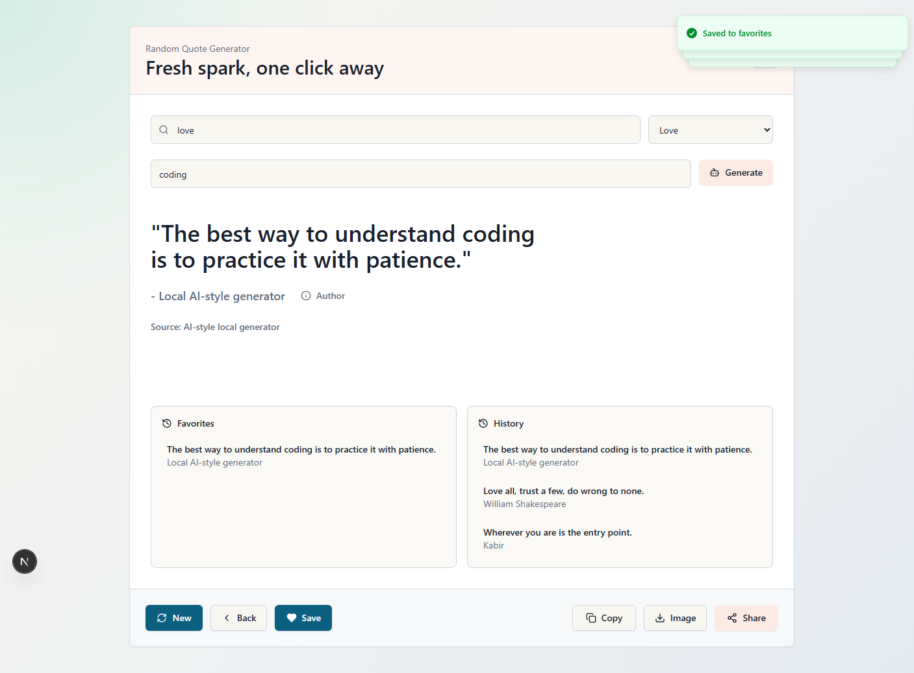
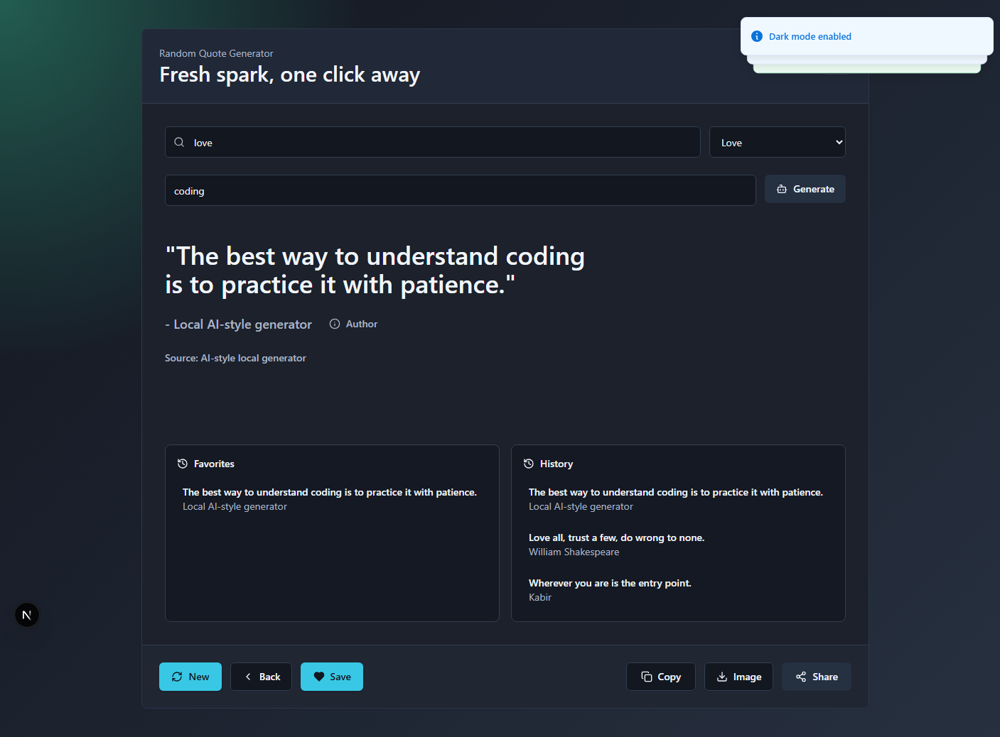
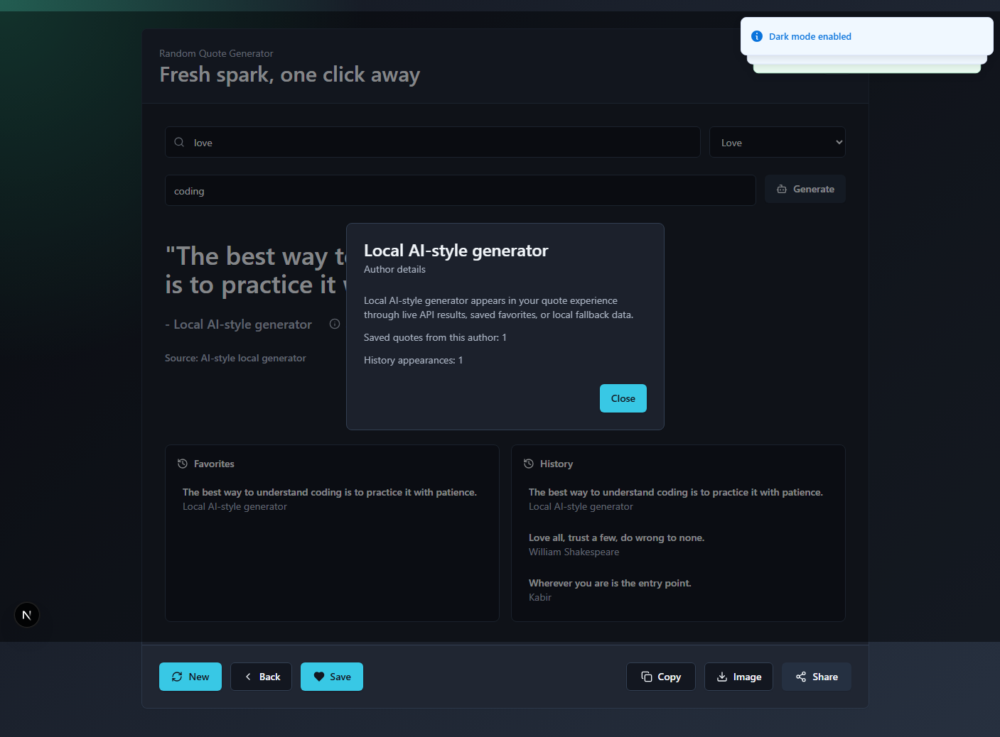

# Random Quote Generator

## Screenshots

### Home View



### Filtered Search



### Topic Generator



### Favorites, History, And Toasts



### Dark Mode



### Author Modal



## Overview

A polished random quote generator built with **Next.js**, **TypeScript**, **Tailwind CSS**, and **shadcn/ui-style components**. The app fetches quotes from live quote APIs, falls back to a local quote collection, and includes useful productivity features like search, favorites, history, themed UI, image download, and toast feedback.

This project is a frontend-focused quote generator that works even when external APIs are unavailable. It tries remote quote providers first, then uses the optimized local fallback quote list.

Quote source order:

```txt
ZenQuotes -> QuotesDB -> QuoteSlate -> Local fallback quotes
```

The app normalizes all API responses into one consistent shape:

```ts
type Quote = {
  text: string;
  author: string;
};
```

## Features

- Random quote generation with multiple API fallbacks
- Optimized local fallback quote collection
- Duplicate skipping for recent quotes
- Category filter for motivation, love, success, life, study, and coding
- Search quotes by author or keyword
- Favorites saved in `localStorage`
- Quote history with back navigation
- Light and dark mode
- Download quote as a PNG image
- Share quote on X/Twitter
- Copy quote to clipboard with fallback handling
- AI-style local topic generator
- Author details modal
- Sonner toast notifications for user events

## Tech Stack

- **Next.js App Router**
- **TypeScript**
- **Tailwind CSS**
- **shadcn/ui-style components**
- **Sonner** for toast notifications
- **Lucide React** for icons
- **LocalStorage** for favorites, history, and theme preference

## Getting Started

Install dependencies:

```bash
npm install
```

Start the development server:

```bash
npm run dev
```

Open the app:

```txt
http://localhost:3000
```

## Deploy To Vercel

This project is ready for free deployment on Vercel through GitHub.

1. Push this project to a GitHub repository.
2. Open [Vercel](https://vercel.com/) and sign in with GitHub.
3. Click **Add New Project**.
4. Import your quote generator repository.
5. Keep these settings:

```txt
Framework Preset: Next.js
Install Command: npm install
Build Command: npm run build
Output Directory: .next
```

6. Click **Deploy**.

No environment variables are required for the current version. The app uses public quote APIs and local fallback quotes.

## Available Scripts

```bash
npm run dev
npm run build
npm run lint
npm run start
```

## Project Structure

```txt
app/
  api/quote/route.ts       Quote API proxy and fallback response
  layout.tsx               App layout and Sonner toaster
  page.tsx                 Main page shell
components/
  quote-card.tsx           Main interactive quote UI
  ui/                      shadcn-style UI components
lib/
  local-quotes.ts          Optimized local quote list
  quote-providers.ts       Remote quote provider fallback chain
  quotes.ts                Quote type and normalization helpers
public/assets/screenshots/ README screenshots and public image assets
```

## Notes

- The topic generator is local and template-based. It does not call a paid AI API.
- API availability may change, so the local fallback keeps the app usable.
- Browser verification screenshots were captured from the running local app.
