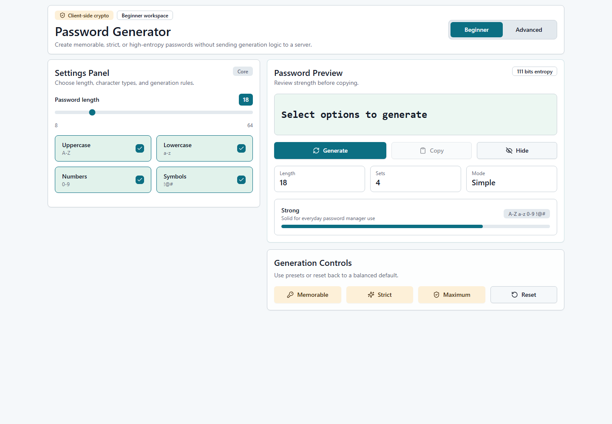
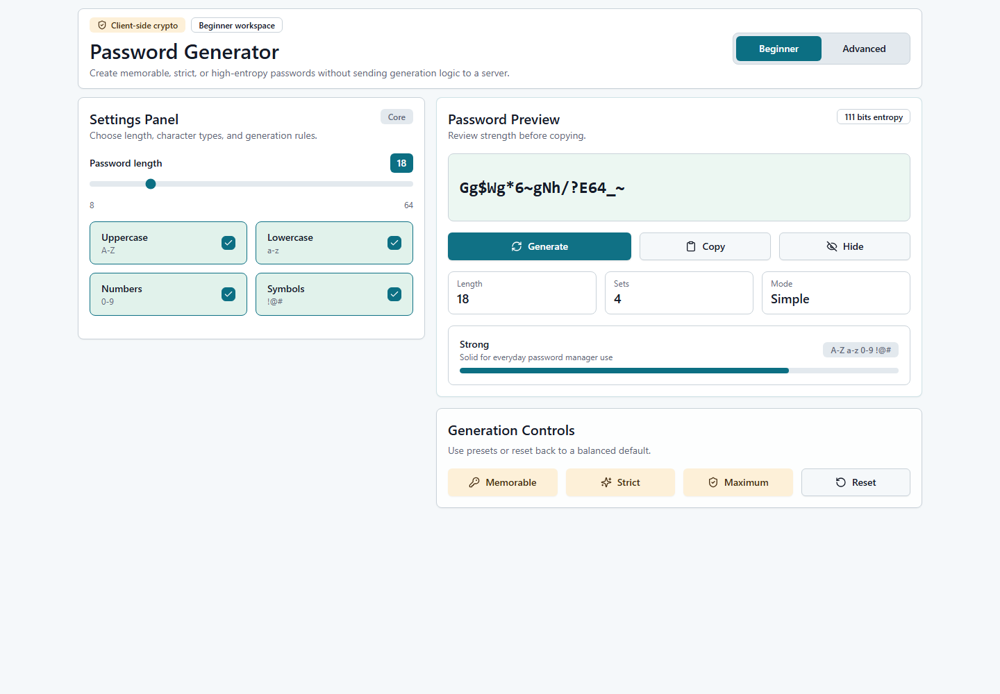
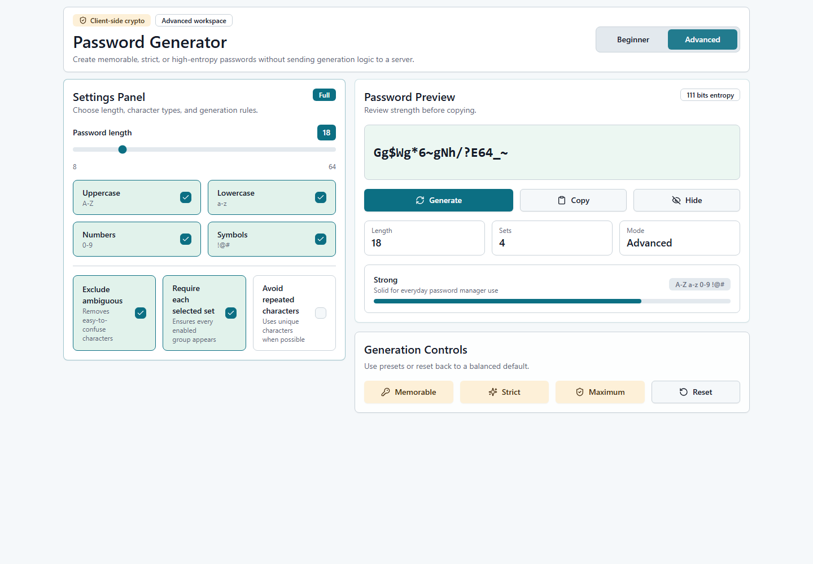
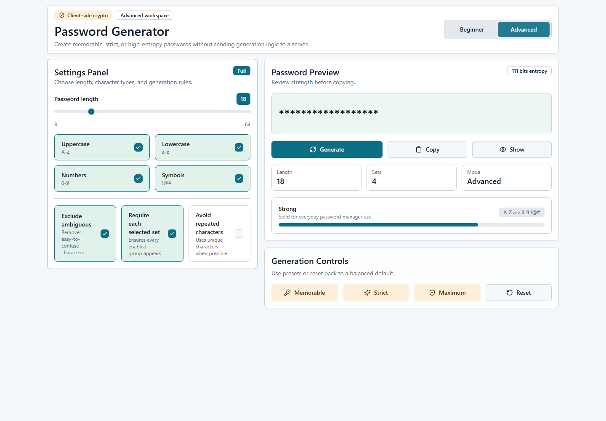
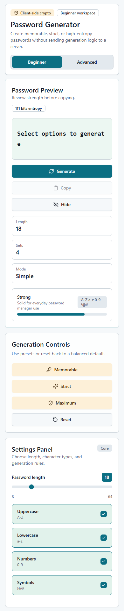
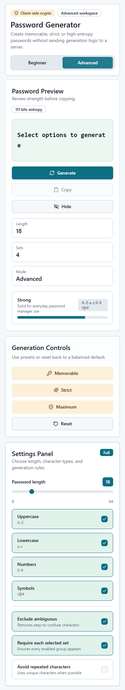

# Password Generator

## Screenshots

| Desktop Beginner | Desktop Generated |
| --- | --- |
|  |  |

| Desktop Advanced | Desktop Hidden Password |
| --- | --- |
|  |  |

| Mobile Beginner | Mobile Advanced |
| --- | --- |
|  |  |

## Overview

Password Generator is a polished, client-side password generation app built with Next.js, TypeScript, Tailwind CSS, and Shadcn/UI-style components. It is designed for both beginner users who want a quick secure password and advanced users who need stricter generation rules.

All password generation happens in the browser using `window.crypto.getRandomValues`. The app does not include any backend password generation logic or API route for creating passwords.

## Features

- Secure browser-side password generation using the Web Crypto API.
- Beginner and advanced workspace modes.
- Password length control from `8` to `64` characters.
- Character set toggles for uppercase letters, lowercase letters, numbers, and symbols.
- Advanced options for excluding ambiguous characters, requiring each selected character set, and avoiding repeats when possible.
- Strength and entropy display.
- Password visibility toggle.
- One-click copy with toast feedback.
- Presets for memorable, strict, and maximum-strength passwords.
- Responsive desktop and mobile layouts.
- Static-export ready for hosting on static platforms.

## Tech Stack

- Next.js `16`
- React `19`
- TypeScript
- Tailwind CSS
- Shadcn/UI-style local components
- Lucide React icons
- Sonner toast notifications

## Project Structure

```text
app/
  globals.css          # Tailwind layers and theme tokens
  layout.tsx           # App metadata and toaster
  page.tsx             # Main route
components/
  password-generator.tsx
  ui/
    badge.tsx
    button.tsx
    card.tsx
    sonner.tsx
lib/
  utils.ts             # Tailwind class merge helper
public/
  assets/
    screenshots/       # README screenshots
```

## Client-Side Security Notes

- Passwords are generated locally in the browser.
- Randomness comes from `window.crypto.getRandomValues`.
- No generated password is sent to a server.
- Copying uses the browser clipboard API only after the user clicks `Copy`.
- The app is safe to deploy as a static site because the generator does not depend on server runtime logic.

## Getting Started

Install dependencies:

```bash
npm install
```

Run the development server:

```bash
npm run dev
```

Open:

```text
http://localhost:3000
```

## Available Scripts

```bash
npm run dev
```

Starts the local Next.js development server.

```bash
npm run build
```

Creates an optimized static export in the `out/` directory.

```bash
npm run start
```

Included as a conventional Next.js script. For this static-export app, use `npm run build` and deploy the generated `out/` directory.

```bash
npm run lint
```

Runs ESLint across the project.

## Deployment

Repository:

```text
https://github.com/Krish-vadsak45/Koders_Summer_Bootcamp/tree/main/03_Password_Generator
```

Expected GitHub Pages URL after deployment:

```text
https://Krish-vadsak45.github.io/Koders_Summer_Bootcamp/
```

The app is configured for static export in `next.config.ts`:

```ts
const nextConfig = {
  output: "export",
  trailingSlash: true,
  basePath: "/Koders_Summer_Bootcamp",
  assetPrefix: "/Koders_Summer_Bootcamp/",
};
```

After running:

```bash
npm run build
```

The included GitHub Actions workflow builds this subfolder and deploys the generated `out/` folder to GitHub Pages.

Good deployment targets:

- Vercel
- Netlify
- Firebase Hosting
- GitHub Pages
- Cloudflare Pages

In local development, `basePath` and `assetPrefix` stay disabled. In GitHub Actions, the workflow sets `GITHUB_PAGES=true`, which enables the repository path prefix automatically.

## Design Notes

- The interface uses a restrained teal, amber, and green palette to communicate security without becoming visually heavy.
- Beginner mode keeps the core settings focused.
- Advanced mode expands the settings panel with stricter password rules.
- Primary actions are placed directly under the password preview for faster workflow.
- The layout keeps cards shallow and avoids nested card structures.

## Accessibility

- Buttons use semantic button elements.
- Toggle controls expose `aria-pressed`.
- Hidden advanced controls are removed from tab order when collapsed.
- Color contrast is maintained through Shadcn/UI-compatible theme tokens.

## License

This project is provided for learning and portfolio use.
