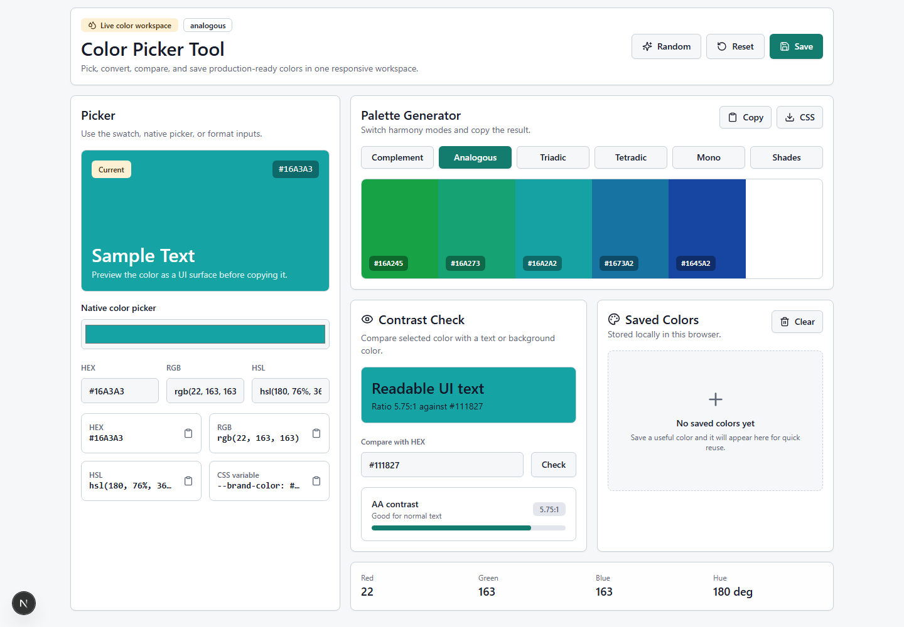
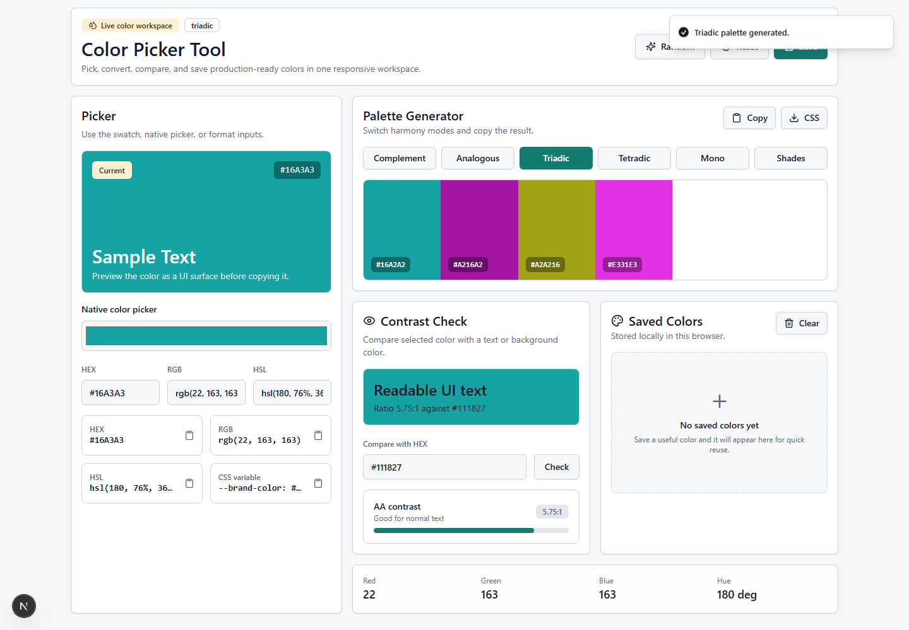
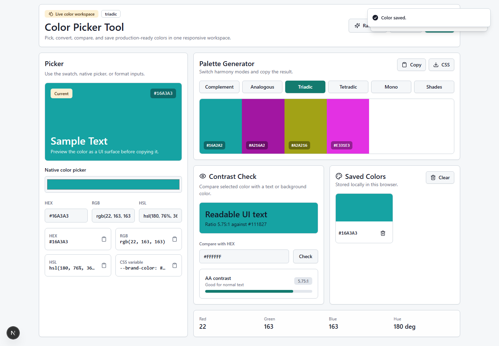
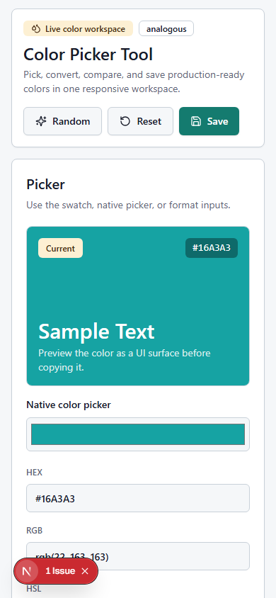
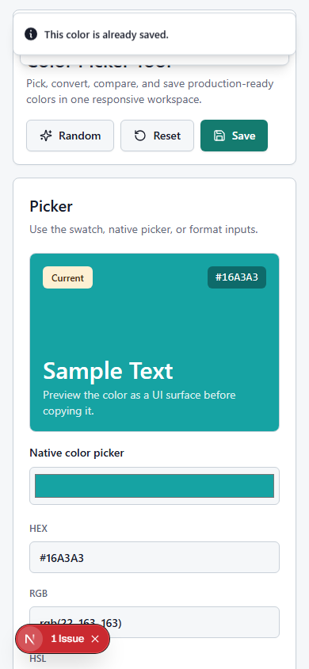

# Color Picker Tool

## Screenshots







A responsive color picker workspace for choosing colors, converting between HEX, RGB, and HSL, generating palettes, checking contrast, and saving useful colors locally.

## Features

- Pick a color visually or enter HEX, RGB, and HSL values directly
- Copy HEX, RGB, HSL, CSS variable, and palette exports
- Generate complementary, analogous, triadic, tetradic, monochrome, and shade palettes
- Check foreground/background contrast with readable pass/fail labels
- Save favorite colors in local storage and remove or clear them later
- Responsive layout for desktop and mobile workflows
- Sonner toast feedback for copy, validation, save, reset, and palette actions

## Tech Stack

- Next.js
- React
- TypeScript
- Tailwind CSS
- shadcn-style local components
- Sonner/toast
- lucide-react

## Getting Started

```bash
npm install
npm run dev
```

Open `http://localhost:3000`.

## Build

```bash
npm run build
```

## Deployment

Vercel deployment link:

```text
Add link after deployment.
```
