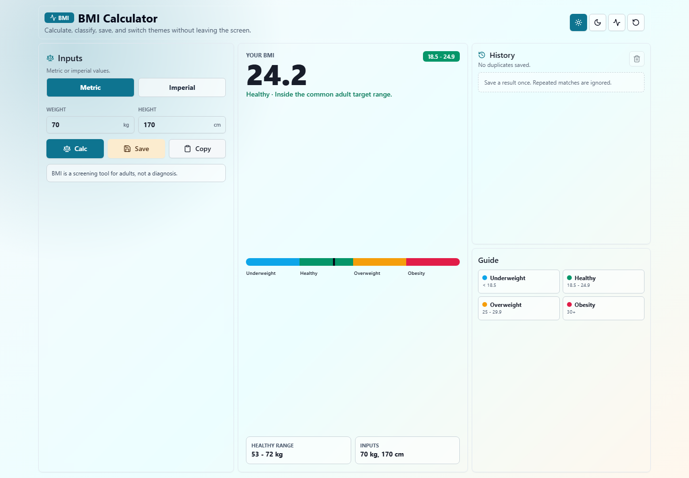
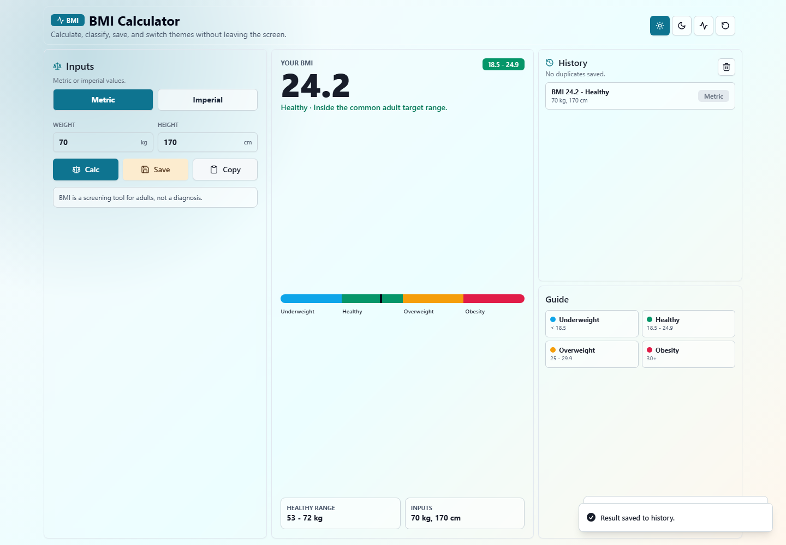
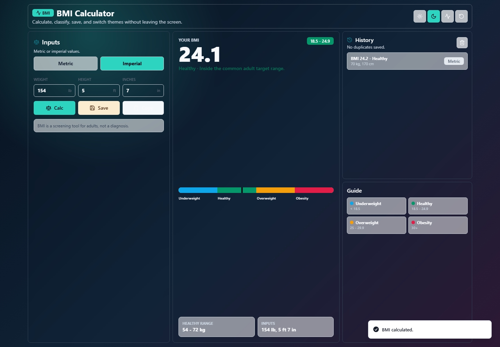
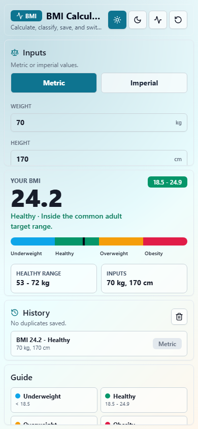
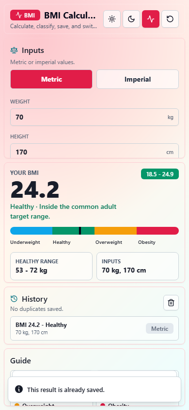

# BMI Calculator

## Screenshots







A responsive BMI calculator for checking body mass index, reviewing the category, estimating a healthy weight range, and saving recent calculations locally.

## Features

- Calculate BMI with metric or imperial units
- View BMI category, range, and plain-language guidance
- See a healthy weight range based on the entered height
- Copy a shareable BMI summary
- Save recent results in local storage while preventing duplicate saves
- Reset the calculator and clear saved history
- Switch between Day, Night, and Pulse visual themes
- Fixed 100VH/100VW responsive layout with no page scrolling
- Sonner toast feedback for validation, calculation, copy, save, reset, and clear actions

## Tech Stack

- Next.js
- React
- TypeScript
- Tailwind CSS
- shadcn-style local components
- Sonner/toast
- lucide-react

## Getting Started

```bash
npm install
npm run dev
```

Open `http://localhost:3000`.

## Build

```bash
npm run build
```

## Project Hygiene

Generated files, local environment files, dependency folders, build output, and local caches are excluded with `.gitignore`.

## Deployment

Vercel deployment link:

```text
Add link after deployment.
```
