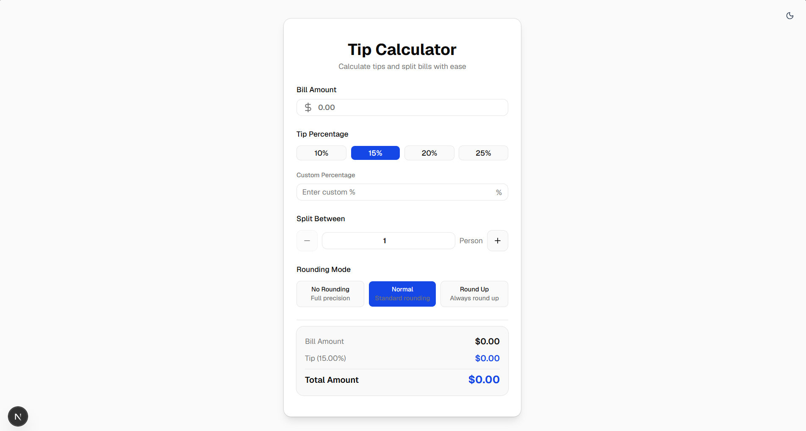
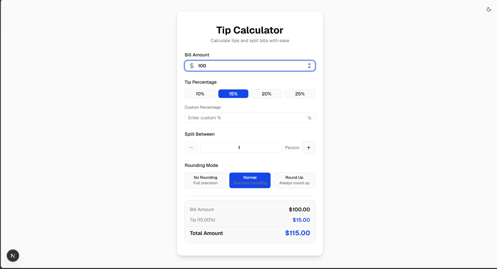
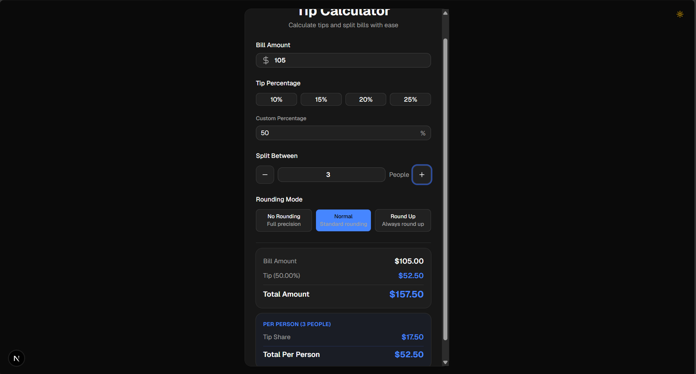
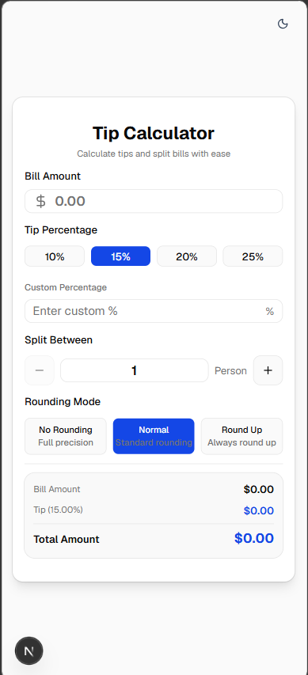
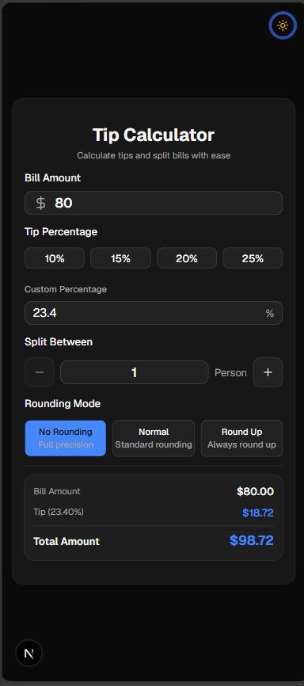

# Tip Calculator

## Screenshots







A comprehensive tip calculator and bill splitter app that helps you calculate tips and split bills with ease. It supports preset and custom tip percentages, bill splitting between multiple people, and various rounding modes for precise or simplified totals.

## Features

- **Bill Amount Input**: Easy-to-use input field with currency formatting.
- **Tip Selection**: Choose from preset percentages (10%, 15%, 20%, 25%) or enter a custom amount.
- **Bill Splitting**: Split the total bill and tip between multiple people.
- **Rounding Modes**: Select between "No Rounding", "Normal" (standard rounding), or "Round Up" (always round up) for the final amounts.
- **Real-time Calculations**: Results update instantly as you change any input.
- **Theming**: Full support for both Light and Dark modes.
- **Responsive Design**: Polished UI that works perfectly on desktop and mobile devices.

## Tech Stack

- Next.js (App Router)
- React
- TypeScript
- Tailwind CSS
- shadcn UI components
- Lucide React icons

## Getting Started

```bash
npm install
npm run dev
```

Open `http://localhost:3000` to view the application.

## Build

```bash
npm run build
```

## Project Hygiene

Generated files, local environment files, dependency folders, build output, and local caches are excluded with `.gitignore`.

## Deployment

Vercel deployment link:

```
Add link after deployment.
```
