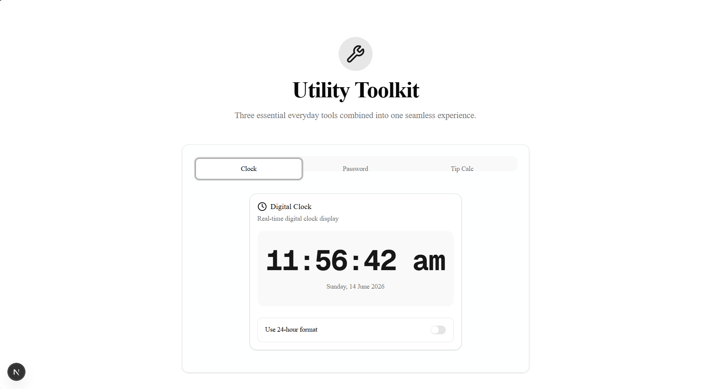
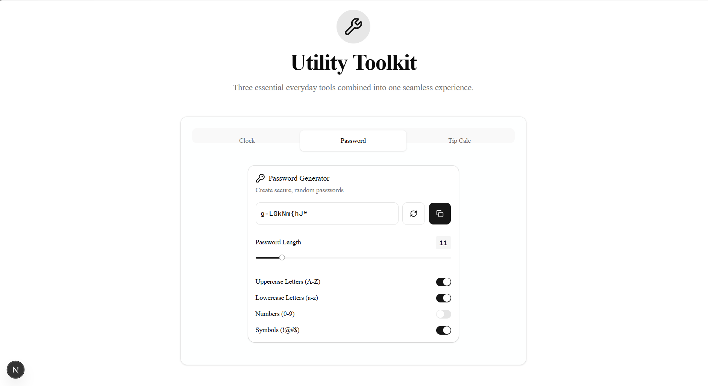
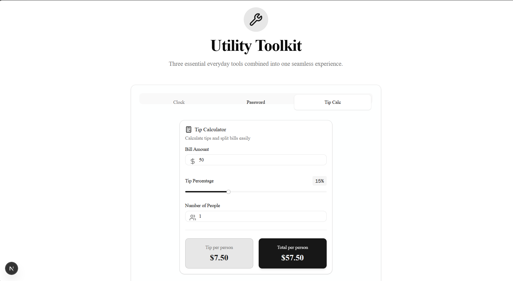
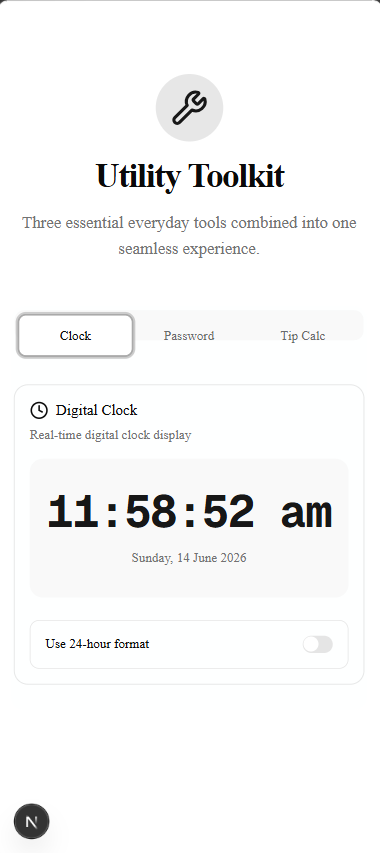
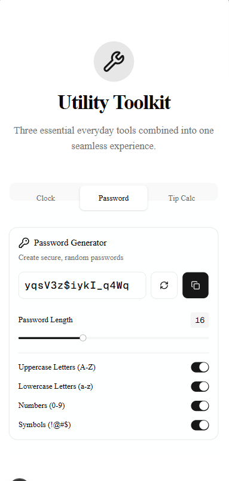

# 07_Utility_Toolkit







## Overview
This project combines three essential everyday tools—a Simple Digital Clock, a Password Generator, and a Tip Calculator—into one seamless, responsive web application. It was built as the day 7 task of the Summer Bootcamp.

## Features
- **Unified Dashboard**: Tabbed interface to switch between tools instantly.
- **Simple Digital Clock**: Displays real-time with an option to toggle between 12-hour and 24-hour formats.
- **Password Generator**: Custom length slider, character type toggles, and one-click copy to clipboard with toast notifications.
- **Tip Calculator**: Computes tip and total per person dynamically based on bill amount, tip percentage slider, and split count.
- **Responsive UI**: Fully optimized for both desktop and mobile screens.

## Tech Stack
- Next.js (App Router)
- React
- TypeScript
- Tailwind CSS
- shadcn/ui
- lucide-react (Icons)
- sonner (Toast notifications)

## Local Setup
1. Navigate to the project directory:
   ```bash
   cd 07_Utility_Toolkit
   ```
2. Install dependencies:
   ```bash
   npm install
   ```
3. Start the development server:
   ```bash
   npm run dev
   ```
4. Open [http://localhost:3000](http://localhost:3000) in your browser.

## Deployment
*(Not deployed yet)*
