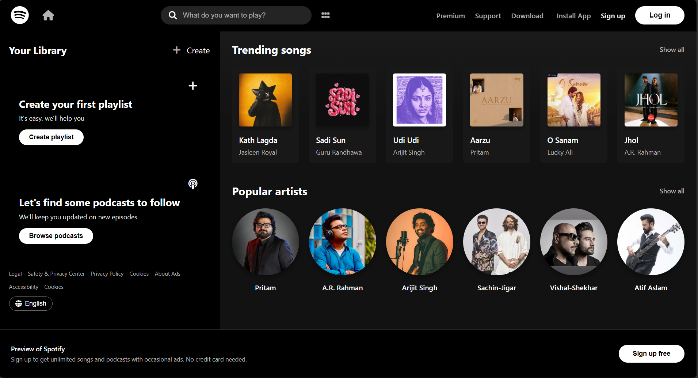

# Spotify Landing Page Clone

## Screenshots



## Overview

A responsive Spotify landing page clone that recreates the modern, dark-themed UI of Spotify's web player. This project demonstrates front-end design skills with a focus on layout, typography, and visual hierarchy matching Spotify's aesthetic.

## Features

- **Responsive Header**: Fixed navigation bar with Spotify logo, search functionality, grid view toggle, and user authentication buttons
- **Sidebar Library**: Left sidebar with "Your Library" section featuring playlist creation cards and podcast discovery prompts
- **Trending Songs Section**: Grid display of 6 song cards with album artwork, song titles, and artist names
- **Popular Artists Section**: Circular artist profile images with artist names in a responsive grid layout
- **Interactive Hover States**: Smooth hover effects on cards, buttons, and navigation elements
- **Custom Scrollbar**: Styled scrollbars matching Spotify's dark theme
- **Footer CTA**: Fixed bottom section with "Preview of Spotify" banner and sign-up call-to-action
- **Legal Links**: Comprehensive footer with legal, privacy, and accessibility links
- **Language Selector**: Language toggle button in the sidebar footer

## Tech Stack

- **HTML5**: Semantic markup structure
- **CSS3**: Styling with Flexbox and Grid layouts, gradients, and custom scrollbars
- **Font Awesome 6.4.0**: Icon library for UI elements (via CDN)
- **Google Fonts**: Circular font family for authentic Spotify typography

## Project Structure

```
09_Spotify_Landing_Page_Clone/
├── index.html          # Main HTML structure
├── style.css           # Complete styling with responsive design
├── assets/             # Images (album art, artist photos)
└── README.md           # Project documentation
```

## Local Setup

1. Navigate to the project directory:
   ```bash
   cd 09_Spotify_Landing_Page_Clone
   ```

2. Start a local server (Python example):
   ```bash
   python -m http.server 8080
   ```

3. Open your browser and visit:
   ```
   http://localhost:8080
   ```

Alternatively, you can simply open `index.html` directly in your browser.

## Design Highlights

- **Dark Theme**: Authentic Spotify black (#000) and dark gray (#181818, #242424) color scheme
- **Gradient Background**: Subtle gradient from #1a1a1a to #121212 in main content area
- **Backdrop Blur**: Header uses backdrop-filter blur effect for modern glass-morphism look
- **Circular Typography**: Uses Spotify's signature Circular font family
- **Responsive Grid**: 6-column grid for songs and artists that adapts to screen size
- **Hover Effects**: Scale transformations and background color changes on interactive elements
- **Rounded Corners**: Consistent border-radius values (4px, 6px, 8px, 500px for buttons)

## Deployment

[Deployment link placeholder - add Vercel/Netlify/other hosting link here]

## Future Enhancements

- Add JavaScript for interactive search functionality
- Implement music playback controls in the footer
- Add responsive mobile menu for smaller screens
- Include more song and artist data
- Add hover play buttons on song cards
- Implement user authentication flow
