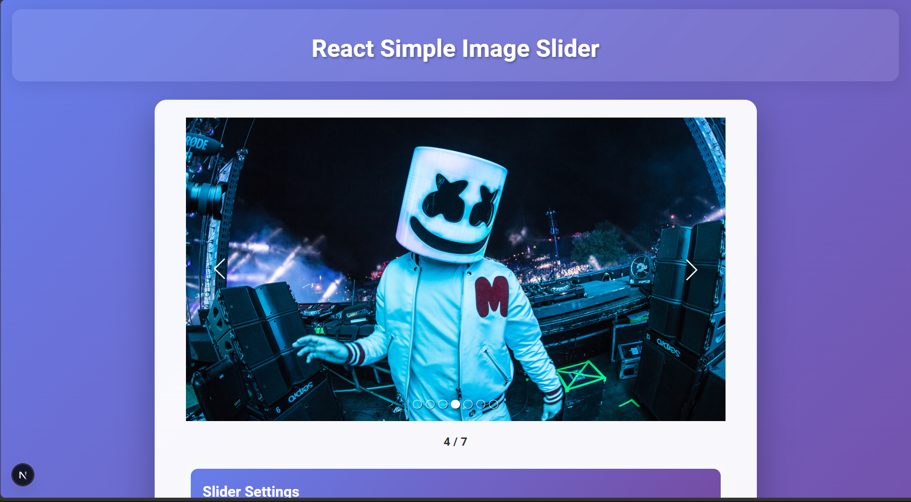
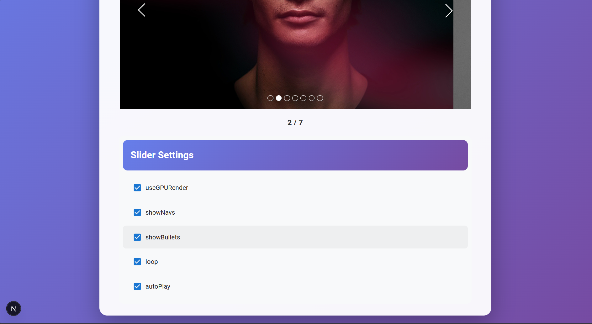

# Image Slider

## Screenshots

| Main View | Settings Panel |
| --- | --- |
|  |  |

## About This Repo

A polished image slider application built with **Next.js**, **React**, **TypeScript**, and **Material-UI**. The app features a fully customizable image slider with navigation arrows, bullet indicators, auto-play functionality, and a comprehensive settings panel to control all slider options in real-time.

This repository is a UI-focused project created as an image slider exercise. The emphasis is on visual polish, responsive layout behavior, and clean component structure with extensive customization options.

## Features

- **Image Slider Core**
  - Smooth image transitions with GPU rendering support
  - Navigation arrows with two style options
  - Bullet indicators for direct image navigation
  - Auto-play with configurable delay
  - Loop mode for continuous playback
  - Customizable slide duration

- **Interactive Settings Panel**
  - Toggle GPU rendering on/off
  - Show/hide navigation arrows
  - Show/hide bullet indicators
  - Enable/disable loop mode
  - Enable/disable auto-play
  - Configure auto-play delay
  - Set starting image index
  - Choose navigation style (1 or 2)
  - Adjust arrow size and margin
  - Customize slide duration
  - Change background color

- **Visual Design**
  - Beautiful gradient background
  - Glassmorphism header with blur effect
  - Clean, modern card-based layout
  - Responsive design for desktop and mobile
  - Real-time slide index display

## Tech Stack

- Next.js App Router
- React 19
- TypeScript
- Material-UI (MUI)
- Tailwind CSS (for custom styling)
- Custom Image Slider component

## Getting Started

Install dependencies:

```bash
npm install
```

Run the development server:

```bash
npm run dev
```

Open the app:

```text
http://localhost:3000
```

Build for production:

```bash
npm run build
```

## Project Structure

```text
app/
  page.tsx              # Main application page with slider and settings
  layout.tsx            # Root layout
  globals.css           # Global styles
components/
  ImageSlider/          # Custom image slider component
    index.tsx
    types.ts
lib/
  utils.ts              # Utility functions
public/
  images/               # Sample images for the slider
    1.jpg
    2.jpg
    3.jpg
    4.jpg
    5.jpg
    6.jpg
    7.jpg
  assets/
    screenshots/        # Project screenshots
```
