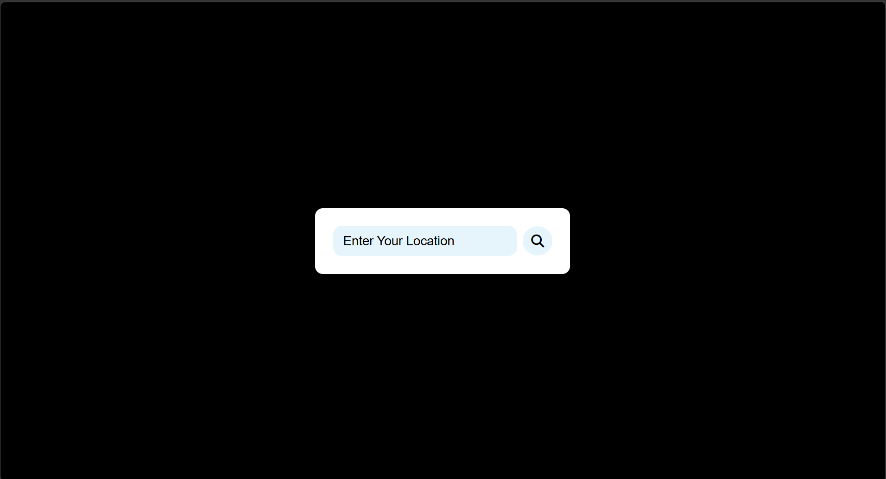
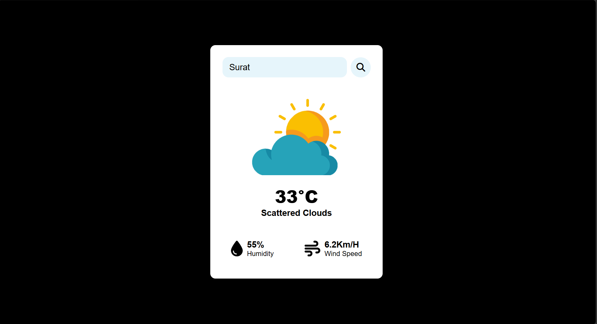
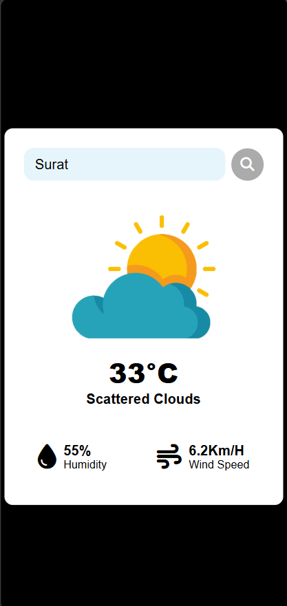

# Weather App

## Screenshots






A simple, responsive weather application built with vanilla JavaScript that fetches real-time weather data from the OpenWeatherMap API.

## Features

- **Real-time Weather Data**: Fetches current weather information for any city worldwide
- **Visual Weather Icons**: Displays appropriate weather icons based on conditions (clouds, clear, rain, mist, snow)
- **Weather Details**: Shows temperature, weather description, humidity, and wind speed
- **Location Search**: Search for weather in any city by name
- **Error Handling**: Displays a friendly error message when a location is not found
- **Responsive Design**: Clean, modern UI that works on desktop and mobile devices

## Tech Stack

- **HTML5**: Semantic markup
- **CSS3**: Styling with Flexbox for responsive layout
- **JavaScript (Vanilla)**: API integration and DOM manipulation
- **OpenWeatherMap API**: Weather data source
- **Font Awesome**: Weather and UI icons

## Project Structure

```
12_Weather_App/
├── index.html          # Main HTML structure
├── style.css           # Styling and responsive design
├── script.js           # JavaScript logic and API integration
├── images/             # Weather condition icons
│   ├── 404.png
│   ├── clear.png
│   ├── cloud.png
│   ├── mist.png
│   ├── rain.png
│   └── snow.png
└── README.md           # Project documentation
```

## Local Setup

1. Clone the repository
2. Navigate to the project directory:
   ```bash
   cd 12_Weather_App
   ```
3. Open `index.html` in a web browser
4. Enter a city name and click the search button to view weather data

## API Key

The project uses the OpenWeatherMap API. The API key is included in `script.js`. For production use, you should:
- Get your own free API key from [OpenWeatherMap](https://openweathermap.org/api)
- Replace the existing API key in the code
- Consider using environment variables for security

## How It Works

1. User enters a city name in the search box
2. JavaScript makes a fetch request to the OpenWeatherMap API
3. API returns weather data in JSON format
4. JavaScript extracts relevant data (temperature, humidity, wind speed, description)
5. UI updates with the weather information and appropriate icon
6. If the city is not found, an error message is displayed

## Weather Conditions Supported

- **Clear**: Sunny/clear sky
- **Clouds**: Cloudy weather
- **Rain**: Rainy conditions
- **Mist**: Misty/foggy weather
- **Snow**: Snowy conditions

## Deployment

This project is configured for GitHub Pages deployment through the global workflow in `.github/workflows/deploy_all.yml`.

## Future Enhancements

- Add forecast for multiple days
- Support for geolocation (user's current location)
- Unit conversion (Celsius/Fahrenheit)
- Recent searches history
- Dark mode toggle
- More detailed weather metrics (UV index, pressure, visibility)

## License

This project is part of the Summer Bootcamp learning series.
