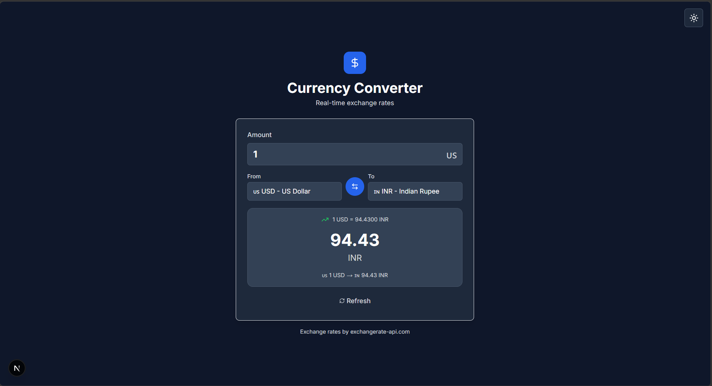
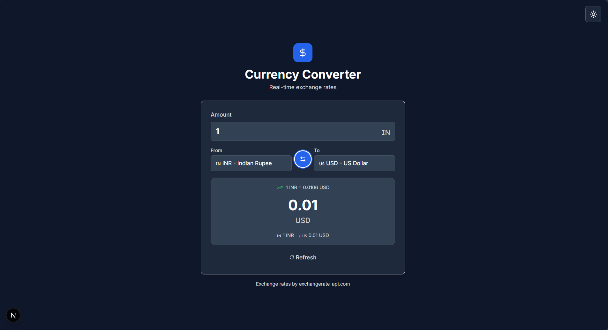
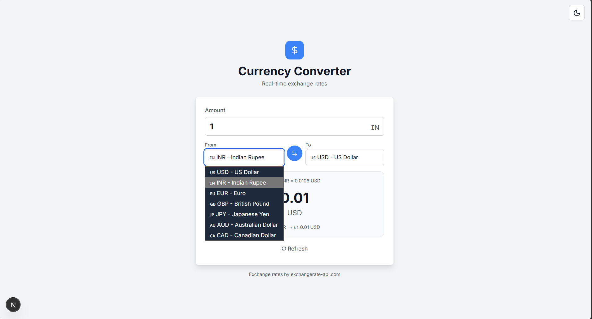
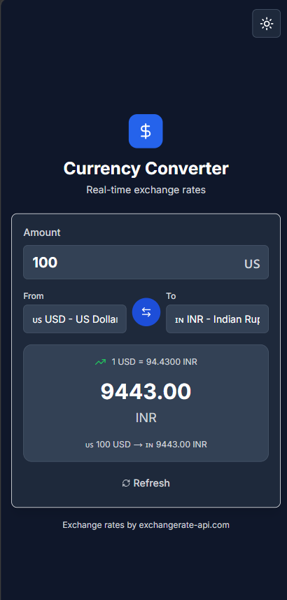
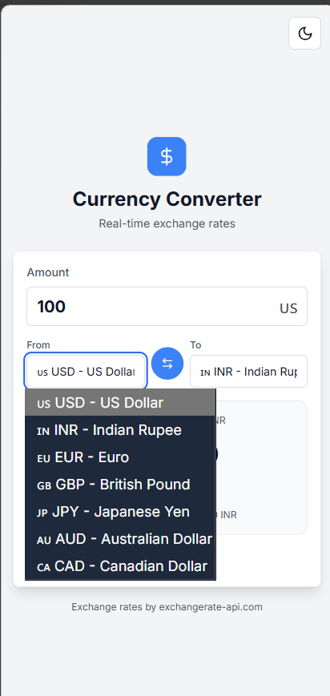

# Currency Converter

## Screenshots

| Home Desktop | Swap Action | Loading State |
| --- | --- | --- |
|  |  |  |

| Home Mobile | Error State |
| --- | --- |
|  |  |

## About This Project

A modern currency converter application built with **Next.js 15**, **React 19**, **TypeScript**, and **Shadcn UI**. This app fetches real-time exchange rates from the exchangerate-api.com API and provides instant currency conversions between multiple currencies with a clean, responsive interface.

This project demonstrates a complete migration from a traditional React + Vite setup to a modern Next.js application with TypeScript and professional UI components.

## Features

- **Real-time Exchange Rates**: Fetches current exchange rates from exchangerate-api.com
- **Multiple Currency Support**: Convert between USD, INR, EUR, GBP, JPY, AUD, and CAD
- **Instant Conversion**: Real-time conversion as you type or change currencies
- **Swap Functionality**: Quick swap between source and target currencies with one click
- **Loading States**: Visual feedback while fetching exchange rates
- **Error Handling**: Graceful error messages when API requests fail
- **Responsive Design**: Works seamlessly on desktop and mobile devices
- **Type Safety**: Full TypeScript coverage for reliable code
- **Modern UI**: Clean, professional interface using Shadcn UI components

## Tech Stack

- **Next.js 15**: React framework with App Router
- **React 19**: UI library
- **TypeScript**: Type-safe JavaScript
- **Tailwind CSS**: Utility-first CSS framework
- **Shadcn UI**: Beautiful, accessible UI components
- **Lucide React**: Modern icon library
- **exchangerate-api.com**: Real-time exchange rate API

## Project Structure

```text
app/
  layout.tsx              # Root layout with metadata
  page.tsx                # Home page
  globals.css             # Global styles with Tailwind
components/
  ui/                     # Shadcn UI components
    button.tsx
    card.tsx
    input.tsx
    select.tsx
  currency-converter.tsx  # Main currency converter component
lib/
  utils.ts                # Utility functions (cn helper)
public/
  assets/
    screenshots/          # Project screenshots
next.config.js            # Next.js configuration
tsconfig.json             # TypeScript configuration
tailwind.config.ts        # Tailwind CSS configuration
package.json              # Dependencies and scripts
```

## Local Setup

1. Clone the repository
2. Navigate to the project directory:
   ```bash
   cd 13_Currency_Converter
   ```
3. Install dependencies:
   ```bash
   npm install
   ```
4. Run the development server:
   ```bash
   npm run dev
   ```
5. Open the app:
   ```text
   http://localhost:3000
   ```

## Build for Production

```bash
npm run build
```

This creates an optimized production build in the `out` directory for static deployment.

## How It Works

1. User enters an amount and selects source and target currencies
2. Application fetches real-time exchange rates from exchangerate-api.com
3. Exchange rates are cached and used for instant conversion
4. User can swap currencies with a single button click
5. Converted amount updates automatically when inputs change
6. Loading states show during API requests
7. Error messages display if API requests fail

## API Integration

This project uses the exchangerate-api.com API which provides:
- Free exchange rate data
- Real-time rates updated hourly
- Support for 170+ currencies
- No API key required for basic usage

## Deployment

This project is configured for GitHub Pages deployment through the global workflow. The project uses static export (`output: 'export'` in next.config.js) to generate static HTML files suitable for GitHub Pages.

### Manual Deployment

To deploy manually:

1. Build the project:
   ```bash
   npm run build
   ```
2. The static files will be in the `out` directory
3. Upload the contents of `out` to your GitHub Pages branch or hosting service

## Migration Notes

This project was migrated from a React + Vite setup to Next.js with the following changes:

- **Build Tool**: Migrated from Vite to Next.js
- **TypeScript**: Added full TypeScript support with proper type definitions
- **UI Components**: Replaced custom components with Shadcn UI components
- **Icons**: Migrated from react-icons to lucide-react
- **Styling**: Updated Tailwind CSS configuration for Shadcn UI compatibility
- **Project Structure**: Reorganized to follow Next.js App Router conventions
- **State Management**: Enhanced with proper TypeScript types and error handling

## Future Enhancements

- Add more currencies (currently supports 7 major currencies)
- Historical exchange rate charts
- Currency conversion history
- Offline support with cached rates
- Dark mode toggle
- Currency favorites/quick select
- Support for cryptocurrency conversion
- Widget mode for embedding in other sites

## License

This project is part of the Summer Bootcamp learning series.
