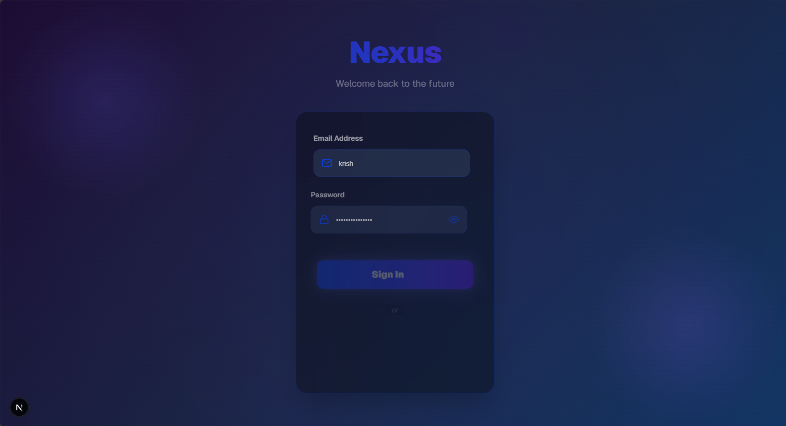
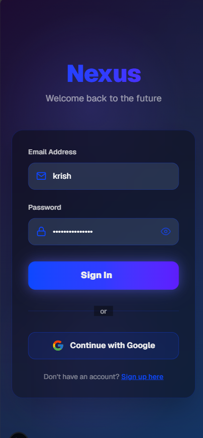

# Login Page - Nexus

## Screenshots

|  |  |

## Overview
A modern, animated login page built with Next.js and Framer Motion. Features a sleek gradient background, smooth animations, password visibility toggle, and Google OAuth integration. Designed as the day 19 task of the Summer Bootcamp.

## Features
- **Email & Password Login**: Secure form with validation and real-time input handling
- **Password Visibility Toggle**: Show/hide password with eye icon
- **Google OAuth Integration**: One-click Google sign-in button
- **Animated Background**: Dynamic gradient orbs with smooth motion effects
- **Smooth Animations**: Framer Motion-powered entrance and hover animations
- **Loading States**: Visual feedback during authentication attempts
- **Responsive Design**: Fully optimized for desktop and mobile screens
- **Dark Mode**: Built with dark theme support

## Tech Stack
- Next.js (App Router)
- React
- TypeScript
- Tailwind CSS
- Framer Motion (Animations)
- react-icons (Icons)
- shadcn/ui components
- @vercel/analytics

## Local Setup
1. Navigate to the project directory:
   ```bash
   cd 19_Login_Page
   ```
2. Install dependencies:
   ```bash
   npm install
   ```
3. Start the development server:
   ```bash
   npm run dev
   ```
4. Open [http://localhost:3000](http://localhost:3000) in your browser.

## Build
```bash
npm run build
```

## Deployment
*(Not deployed yet)*
