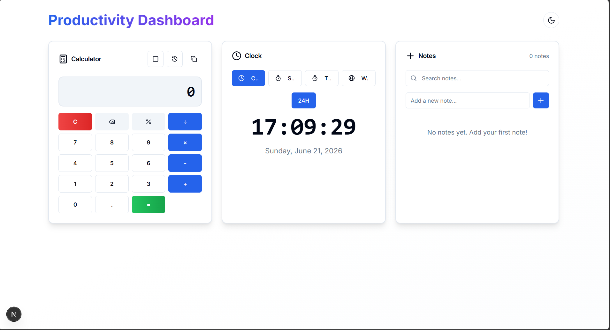
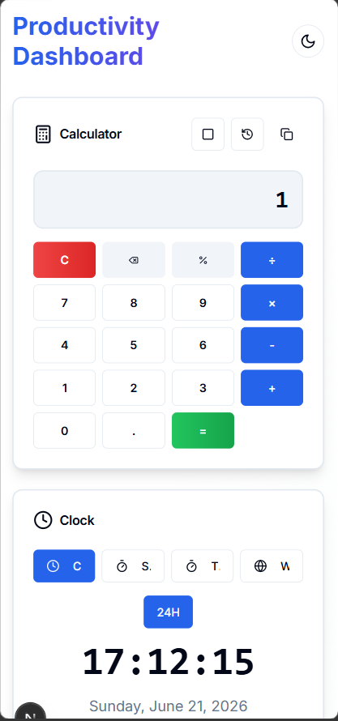
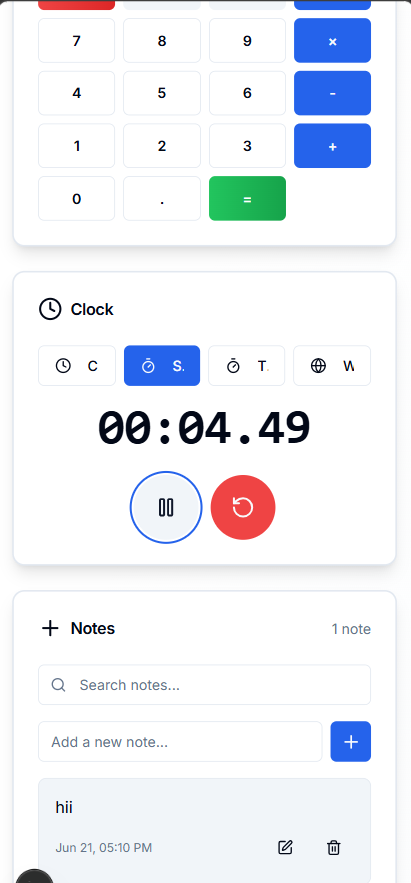

# Productivity Dashboard

A modern, feature-rich productivity dashboard built with Next.js 15, React 19, TypeScript, and Tailwind CSS. Features a calculator, multi-mode clock, notes, pomodoro timer, task list, and calendar widget with beautiful design and dark mode support.

## Screenshots

## Features

### 🧮 Calculator
- Basic arithmetic operations (add, subtract, multiply, divide)
- Scientific mode with advanced functions:
  - Trigonometric: sin, cos, tan
  - Logarithmic: log (base 10), ln (natural log)
  - Constants: π (pi), e (Euler's number)
  - Square root (√) and power (x²)
  - Percentage (%)
- Calculation history with clickable entries
- Keyboard support for all operations
- Copy result to clipboard
- Responsive grid layout

### ⏰ Clock
- **Digital Clock**: Real-time display with 12/24-hour toggle
- **Stopwatch**: Precise timing with centisecond accuracy, start/pause/reset controls
- **Timer**: Customizable countdown timer with minute/second adjustment
- **World Clock**: View time in 6 major cities (New York, London, Tokyo, Sydney, Paris, Dubai)
- Tab-based navigation between modes
- Toast notifications for timer completion

### 📝 Notes
- Create, edit, and delete notes
- Search functionality to filter notes
- Local storage persistence
- Timestamps for each note
- Responsive design with scrollable list

### 🍅 Pomodoro Timer
- Focus sessions (25 min), short breaks (5 min), long breaks (15 min)
- Session tracking with automatic break suggestions after 4 focus sessions
- Visual progress indicator with gradient colors
- Play/pause/reset controls
- Toast notifications for session completion
- Mode switching between work and break periods

### ✅ Task List
- Create, edit, and delete tasks
- Priority levels (High, Medium, Low) with color-coded badges
- Due date support with overdue detection
- Filter by status (All/Active/Completed) and priority
- Local storage persistence
- Task completion tracking with visual indicators
- Responsive design with scrollable list

### 📅 Calendar Widget
- Interactive monthly calendar view
- Navigate between months with arrow buttons
- Quick "Today" button for current date
- Date selection with full date display
- Visual highlighting for today's date and selected date
- Responsive grid layout

## Tech Stack

- **Framework**: Next.js 15 with App Router
- **Language**: TypeScript
- **Styling**: Tailwind CSS
- **UI Components**: shadcn/ui-inspired components (Card, Button, Input, Textarea)
- **Icons**: lucide-react
- **Notifications**: Sonner (toast notifications)
- **Theming**: next-themes (dark/light mode)
- **Storage**: LocalStorage API

## Getting Started

### Prerequisites

- Node.js 18+ installed
- npm or yarn package manager

### Installation

1. Navigate to the project directory:
`ash
cd 21_Productivity_Dashboard
`

2. Install dependencies:
`ash
npm install
`

3. Run the development server:
`ash
npm run dev
`

4. Open [http://localhost:3000](http://localhost:3000) in your browser

### Build for Production

`ash
npm run build
npm start
`

## Project Structure

`
21_Productivity_Dashboard/
├── app/
│   ├── layout.tsx          # Root layout with theme provider
│   ├── page.tsx            # Main dashboard page
│   └── globals.css         # Global styles with theme variables
├── components/
│   ├── Calculator.tsx      # Calculator component with scientific mode
│   ├── Clock.tsx            # Clock component with multiple modes
│   ├── Notes.tsx           # Notes component with CRUD operations
│   ├── Pomodoro.tsx        # Pomodoro timer component
│   ├── TaskList.tsx        # Task list component
│   ├── Calendar.tsx        # Calendar widget component
│   ├── theme-provider.tsx  # Theme provider wrapper
│   ├── theme-toggle.tsx    # Theme toggle button
│   └── ui/                 # shadcn/ui-inspired components
│       ├── button.tsx
│       ├── card.tsx
│       ├── input.tsx
│       └── textarea.tsx
├── lib/
│   ├── storage.ts          # Local storage helpers
│   └── utils.ts            # Utility functions
├── package.json
├── tsconfig.json
├── tailwind.config.ts
└── next.config.js
`

## Features in Detail

### Calculator Scientific Mode

Toggle scientific mode to access advanced mathematical functions:
- **sin/cos/tan**: Trigonometric functions (input in radians)
- **log**: Base-10 logarithm
- **ln**: Natural logarithm
- **π**: Pi constant (3.14159...)
- **e**: Euler's number (2.71828...)
- **√**: Square root
- **x²**: Power function (enter base, then x², then exponent)

### Keyboard Shortcuts

- **0-9**: Enter digits
- **+ - * /**: Operations
- **.**: Decimal point
- **Enter or =**: Calculate result
- **Escape**: Clear all
- **Backspace**: Delete last digit
- **%**: Percentage

### Pomodoro Timer

- **Work Mode**: 25-minute focus sessions for deep work
- **Short Break**: 5-minute breaks between work sessions
- **Long Break**: 15-minute breaks after completing 4 work sessions
- **Session Tracking**: Automatically counts completed focus sessions
- **Visual Progress**: Gradient progress bar shows time remaining
- **Auto Mode Switch**: Automatically switches between work and break modes

### Task List

- **Priority System**: Color-coded badges (High=red, Medium=yellow, Low=green)
- **Due Dates**: Set optional due dates with visual overdue indicators
- **Filtering**: Filter tasks by completion status and priority level
- **Persistence**: All tasks saved to local storage
- **Quick Actions**: Inline editing and one-click completion

### Theme Toggle

Click the sun/moon icon in the header to switch between light and dark themes. The theme preference is saved and persists across sessions.

## Deployment

This project can be deployed to various platforms:

### Vercel (Recommended)
`ash
npm install -g vercel
vercel
`

### GitHub Pages
1. Build the project: 
pm run build
2. Configure GitHub Pages in repository settings
3. Set build command to 
pm run build
4. Set output directory to out (requires static export)

### Static Export
To create a static export for GitHub Pages:
1. Update 
ext.config.js to add output: 'export'
2. Run 
pm run build
3. Deploy the out folder

## License

This project is part of the Koders Summer Bootcamp 2026.

## Acknowledgments

- Built with [Next.js](https://nextjs.org/)
- UI components inspired by [shadcn/ui](https://ui.shadcn.com/)
- Icons from [lucide-react](https://lucide.dev/)
- Toast notifications by [Sonner](https://sonner.emilkowalski.com/)
