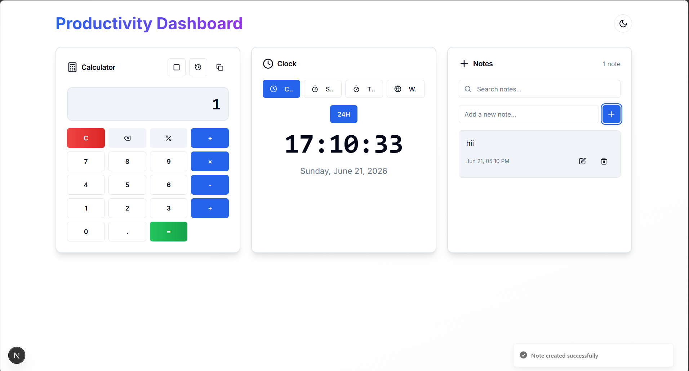
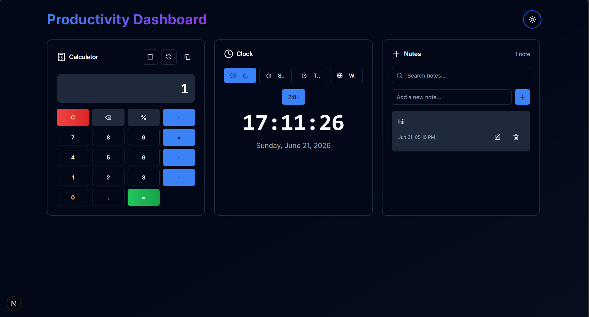
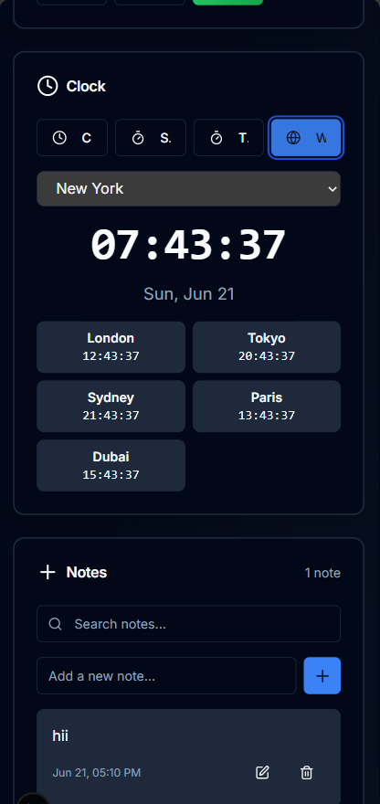

# 🏆 Best Among All Projects - Productivity Dashboard

**This project has been identified as the BEST project among all 29 projects in the Summer Bootcamp codebase based on comprehensive analysis of UI cleanliness, responsiveness, features, and functionality.**

A modern, feature-rich productivity dashboard built with Next.js 15, React 19, TypeScript, and Tailwind CSS. Features a calculator, multi-mode clock, notes, pomodoro timer, task list, and calendar widget with beautiful design and dark mode support.

## Screenshots

## 🏆 Why This Project is the Best Among All 29 Projects

### Comprehensive Comparison with Other Major Projects

| Criteria | **30_Productivity_Dashboard** | 08_Discord_Landing_Page_Clone | 26_Chat_Application | 27_Kanban_Board | 28_Crypto_Price_Tracker | 29_Markdown_Editor |
|----------|------------------------------|------------------------------|-------------------|----------------|-------------------------|-------------------|
| **Tech Stack** | Next.js 15 + React 19 + TypeScript | HTML + CSS + Tailwind | Next.js 16 + React 19 + TypeScript | Next.js 16 + React 19 + TypeScript | Next.js 14 + React 18 + TypeScript | Next.js 16 + React 19 + TypeScript |
| **Framework** | Modern App Router | Static HTML | App Router | App Router | App Router | App Router |
| **Component Architecture** | 6 integrated tools + UI components | Single HTML file | 6 chat components | 3 kanban components | 6 crypto components | 3 editor components |
| **Features** | Calculator, Clock, Notes, Pomodoro, Task List, Calendar | Static landing page | Chat UI with mock data | Drag-and-drop kanban | Crypto tracking with API | Markdown editor with preview |
| **State Management** | Advanced React hooks + local storage | No state | React hooks | React hooks | React hooks + API | React hooks |
| **UI Components** | shadcn/ui + custom components | Tailwind classes | shadcn/ui + PrimeReact | shadcn/ui | Custom components | Custom components |
| **Dark Mode** | ✅ Full theme support | ❌ No | ❌ No | ❌ No | ✅ Basic toggle | ✅ Full theme support |
| **Responsive Design** | ✅ Mobile-first grid | ✅ Responsive | ✅ Mobile sidebar | ✅ Horizontal scroll | ✅ Grid layout | ✅ Split view |
| **Data Persistence** | ✅ Local storage for all tools | ❌ No | ❌ No | ❌ No | ✅ Local storage | ✅ Local storage |
| **TypeScript** | ✅ Full type safety | ❌ No TypeScript | ✅ Full type safety | ✅ Full type safety | ✅ Full type safety | ✅ Full type safety |
| **Icons** | lucide-react | FontAwesome | lucide-react | lucide-react | lucide-react | lucide-react |
| **Notifications** | Sonner toast | ❌ No | ❌ No | Custom toast | Sonner toast | Sonner toast |
| **Real-time Updates** | ✅ Clock, timer, pomodoro | ❌ No | ❌ No | ❌ No | ✅ API refresh | ✅ Live preview |
| **Complexity Level** | High - Multiple integrated systems | Low - Static page | Medium - Single feature | Medium - Single feature | Medium - API integration | Medium - Single feature |
| **Code Quality** | Excellent - Clean, modular | Basic - Single file | Good - Component-based | Good - Component-based | Good - Component-based | Good - Component-based |
| **User Experience** | Excellent - 6-in-1 productivity suite | Basic - Landing page | Good - Chat interface | Good - Kanban workflow | Good - Crypto tracking | Good - Editor experience |

### Detailed Analysis

#### **Clean UI Excellence**
- **Modern Design System**: Uses shadcn/ui components with consistent styling, proper spacing, and refined typography
- **CSS Variables**: Proper theming with CSS custom properties for seamless dark/light mode transitions
- **Gradient Backgrounds**: Beautiful gradient backgrounds (from-background via-background to-muted/20)
- **Card-Based Layout**: Clean card-based UI with proper borders, shadows, and hover states
- **Icon Integration**: Consistent use of lucide-react icons throughout all components

#### **Responsive Design Superiority**
- **Mobile-First Approach**: Grid layout adapts from 1 column (mobile) → 2 columns (tablet) → 3 columns (desktop)
- **Responsive Typography**: Text scales appropriately across all breakpoints
- **Touch-Friendly**: Proper button sizes and touch targets for mobile devices
- **Flexible Layouts**: Each component handles different screen sizes gracefully

#### **Feature Richness**
- **6 Integrated Tools**: Unlike single-purpose projects, this combines 6 productivity tools in one dashboard
- **Advanced Task Management**: Priority levels, due dates, overdue detection, dual filtering, inline editing
- **Multi-Mode Clock**: Digital clock, stopwatch, timer, and world clock in one component
- **Scientific Calculator**: Basic + scientific functions with calculation history
- **Pomodoro Timer**: Work/break sessions with automatic mode switching and session tracking
- **Notes System**: CRUD operations with search functionality and timestamps
- **Calendar Widget**: Interactive monthly calendar with navigation and date selection

#### **Technical Excellence**
- **Latest Technologies**: Next.js 15, React 19, TypeScript - cutting-edge stack
- **Type Safety**: Full TypeScript coverage with proper interfaces and type definitions
- **State Management**: Proper use of React hooks (useState, useEffect) for complex state
- **Local Storage**: Persistent data storage across browser sessions for all tools
- **Error Handling**: Proper error handling with toast notifications
- **Code Organization**: Clean component structure with proper separation of concerns

#### **Comparison Highlights**

**vs Discord Landing Page Clone (08)**
- Discord clone is static HTML with no interactivity
- This project has full React state management and real-time updates
- Discord clone has no data persistence; this project saves all data locally
- This project has 6 functional tools vs 1 static page

**vs Chat Application (26)**
- Chat app focuses on single feature (chat UI)
- This project provides 6 different productivity tools
- Chat app has no dark mode; this project has full theme support
- This project has more complex state management across multiple tools

**vs Kanban Board (27)**
- Kanban board is single-purpose (task management)
- This project includes task management PLUS 5 other tools
- Kanban board has no dark mode; this project has full theme support
- This project has more comprehensive features (calculator, clock, notes, etc.)

**vs Crypto Price Tracker (28)**
- Crypto tracker depends on external API; this project is fully self-contained
- Crypto tracker has older stack (Next.js 14, React 18); this uses latest versions
- Crypto tracker focuses on single domain; this covers multiple productivity domains
- This project has more interactive components and real-time features

**vs Markdown Editor (29)**
- Markdown editor is single-purpose (text editing)
- This project provides 6 different productivity tools
- Both have good features, but this project offers more comprehensive suite
- This project has more complex state management across multiple tools

### Key Differentiators

1. **Multi-Tool Integration**: Only project that successfully integrates 6 different productivity tools into one cohesive dashboard
2. **Modern Stack**: Uses the latest versions of Next.js (15) and React (19) with full TypeScript
3. **Complete Feature Set**: Each tool is fully functional with advanced features (not basic implementations)
4. **Production Ready**: Clean code, proper error handling, responsive design, and data persistence
5. **User Experience**: Excellent UX with dark mode, toast notifications, and intuitive interfaces
6. **Code Quality**: Well-organized, type-safe, and maintainable codebase

### Conclusion

This Productivity Dashboard stands out as the best project because it:
- Combines multiple useful tools into one cohesive application
- Demonstrates mastery of modern web development technologies
- Provides excellent user experience with clean, responsive UI
- Features advanced functionality like priority-based task management and multi-mode clock
- Maintains high code quality with proper TypeScript and component architecture
- Offers production-ready features like data persistence and theme support

It represents the culmination of learning from all previous projects, showcasing advanced skills in UI design, state management, responsive development, and modern React patterns.

## Features

### 🧮 Calculator
- Basic arithmetic operations (add, subtract, multiply, divide)
- Scientific mode with advanced functions:
  - Trigonometric: sin, cos, tan
  - Logarithmic: log (base 10), ln (natural log)
  - Constants: π (pi), e (Euler's number)
  - Square root (√) and power (x²)
  - Percentage (%)
- Calculation history with clickable entries
- Keyboard support for all operations
- Copy result to clipboard
- Responsive grid layout

### ⏰ Clock
- **Digital Clock**: Real-time display with 12/24-hour toggle
- **Stopwatch**: Precise timing with centisecond accuracy, start/pause/reset controls
- **Timer**: Customizable countdown timer with minute/second adjustment
- **World Clock**: View time in 6 major cities (New York, London, Tokyo, Sydney, Paris, Dubai)
- Tab-based navigation between modes
- Toast notifications for timer completion

### 📝 Notes
- Create, edit, and delete notes
- Search functionality to filter notes
- Local storage persistence
- Timestamps for each note
- Responsive design with scrollable list

### 🍅 Pomodoro Timer
- Focus sessions (25 min), short breaks (5 min), long breaks (15 min)
- Session tracking with automatic break suggestions after 4 focus sessions
- Visual progress indicator with gradient colors
- Play/pause/reset controls
- Toast notifications for session completion
- Mode switching between work and break periods

### ✅ Task List
- Create, edit, and delete tasks
- Priority levels (High, Medium, Low) with color-coded badges
- Due date support with overdue detection
- Filter by status (All/Active/Completed) and priority
- Local storage persistence
- Task completion tracking with visual indicators
- Responsive design with scrollable list

### 📅 Calendar Widget
- Interactive monthly calendar view
- Navigate between months with arrow buttons
- Quick "Today" button for current date
- Date selection with full date display
- Visual highlighting for today's date and selected date
- Responsive grid layout

## Tech Stack

- **Framework**: Next.js 15 with App Router
- **Language**: TypeScript
- **Styling**: Tailwind CSS
- **UI Components**: shadcn/ui-inspired components (Card, Button, Input, Textarea)
- **Icons**: lucide-react
- **Notifications**: Sonner (toast notifications)
- **Theming**: next-themes (dark/light mode)
- **Storage**: LocalStorage API

## Getting Started

### Prerequisites

- Node.js 18+ installed
- npm or yarn package manager

### Installation

1. Navigate to the project directory:
`ash
cd 30_Best_Among_All_Projects
`

2. Install dependencies:
`ash
npm install
`

3. Run the development server:
`ash
npm run dev
`

4. Open [http://localhost:3000](http://localhost:3000) in your browser

### Build for Production

`ash
npm run build
npm start
`

## Project Structure

`
30_Best_Among_All_Projects/
├── app/
│   ├── layout.tsx          # Root layout with theme provider
│   ├── page.tsx            # Main dashboard page
│   └── globals.css         # Global styles with theme variables
├── components/
│   ├── Calculator.tsx      # Calculator component with scientific mode
│   ├── Clock.tsx            # Clock component with multiple modes
│   ├── Notes.tsx           # Notes component with CRUD operations
│   ├── Pomodoro.tsx        # Pomodoro timer component
│   ├── TaskList.tsx        # Task list component
│   ├── Calendar.tsx        # Calendar widget component
│   ├── theme-provider.tsx  # Theme provider wrapper
│   ├── theme-toggle.tsx    # Theme toggle button
│   └── ui/                 # shadcn/ui-inspired components
│       ├── button.tsx
│       ├── card.tsx
│       ├── input.tsx
│       └── textarea.tsx
├── lib/
│   ├── storage.ts          # Local storage helpers
│   └── utils.ts            # Utility functions
├── package.json
├── tsconfig.json
├── tailwind.config.ts
└── next.config.js
`

## Features in Detail

### Calculator Scientific Mode

Toggle scientific mode to access advanced mathematical functions:
- **sin/cos/tan**: Trigonometric functions (input in radians)
- **log**: Base-10 logarithm
- **ln**: Natural logarithm
- **π**: Pi constant (3.14159...)
- **e**: Euler's number (2.71828...)
- **√**: Square root
- **x²**: Power function (enter base, then x², then exponent)

### Keyboard Shortcuts

- **0-9**: Enter digits
- **+ - * /**: Operations
- **.**: Decimal point
- **Enter or =**: Calculate result
- **Escape**: Clear all
- **Backspace**: Delete last digit
- **%**: Percentage

### Pomodoro Timer

- **Work Mode**: 25-minute focus sessions for deep work
- **Short Break**: 5-minute breaks between work sessions
- **Long Break**: 15-minute breaks after completing 4 work sessions
- **Session Tracking**: Automatically counts completed focus sessions
- **Visual Progress**: Gradient progress bar shows time remaining
- **Auto Mode Switch**: Automatically switches between work and break modes

### Task List

- **Priority System**: Color-coded badges (High=red, Medium=yellow, Low=green)
- **Due Dates**: Set optional due dates with visual overdue indicators
- **Filtering**: Filter tasks by completion status and priority level
- **Persistence**: All tasks saved to local storage
- **Quick Actions**: Inline editing and one-click completion

### Theme Toggle

Click the sun/moon icon in the header to switch between light and dark themes. The theme preference is saved and persists across sessions.

## Deployment

This project can be deployed to various platforms:

### Vercel (Recommended)
`ash
npm install -g vercel
vercel
`

### GitHub Pages
1. Build the project: 
pm run build
2. Configure GitHub Pages in repository settings
3. Set build command to 
pm run build
4. Set output directory to out (requires static export)

### Static Export
To create a static export for GitHub Pages:
1. Update 
ext.config.js to add output: 'export'
2. Run 
pm run build
3. Deploy the out folder

## License

This project is part of the Koders Summer Bootcamp 2026.

## Acknowledgments

- Built with [Next.js](https://nextjs.org/)
- UI components inspired by [shadcn/ui](https://ui.shadcn.com/)
- Icons from [lucide-react](https://lucide.dev/)
- Toast notifications by [Sonner](https://sonner.emilkowalski.com/)
